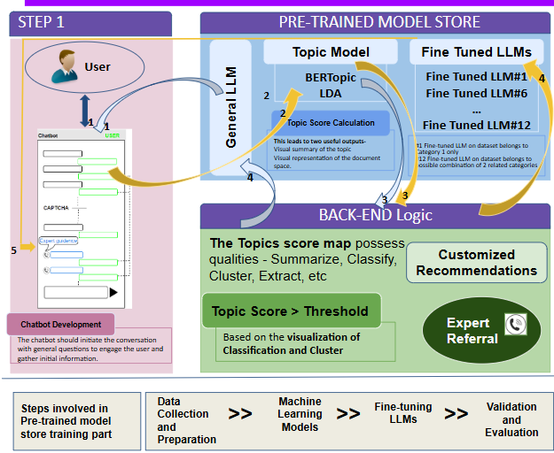
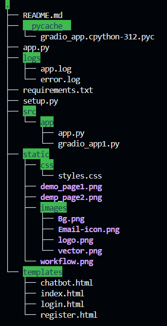
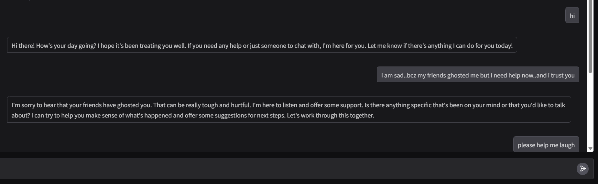
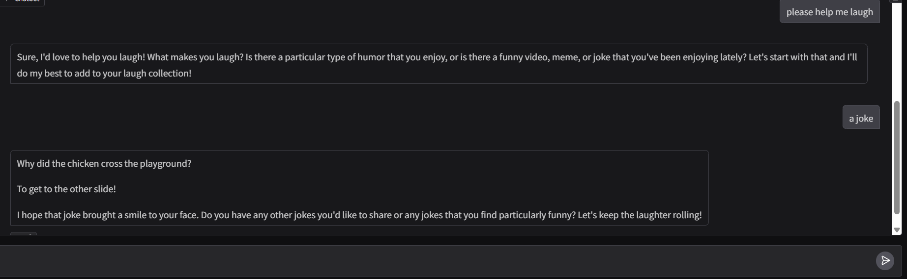

# Mansukh - Mental Health Chatbot

Mansukh is a mental health chatbot designed to provide support and guidance for users. It leverages pre-trained models and advanced NLP techniques to assess mental health characteristics and offer tailored recommendations.

DEMO chatbot images below.....

## Features
- User-friendly chatbot for web and mobile applications.
- Pre-trained models for handling basic inquiries and mental health information.
- Scoring system to calculate topic scores for mental health characteristics.
- Tailored funnels for specific mental health domains.
- Expert referrals with user consent.
- Continuous model improvement based on feedback and new data.

## Technology Stack
- **Backend**: Python, Flask
- **Machine Learning**: HuggingFace Transformers, LangChain
- **Database**: MySQL
- **Frontend**: HTML, CSS
- **AI Models**: Zephyr-7b-beta
- **Development Tools**: 
  - Gradio for interactive UI
  - Docker for containerization
  - GitHub Actions for CI/CD
  - Pytest for testing

  ## Workflow
  

  ## Folder Structure


## Future Goals
1. **Advanced AI Integration**
   - Implement GPT-4 integration for enhanced conversational abilities
   - Add multilingual support using advanced language models
   - Develop emotion detection from text input

2. **Platform Enhancement**
   - Real-time voice interaction capabilities
   - Mobile application development (iOS/Android)
   - Integration with wearable devices for mood tracking

3. **Security & Compliance**
   - HIPAA compliance implementation
   - Enhanced data encryption
   - OAuth 2.0 authentication
   - Regular security audits

4. **Analytics & Monitoring**
   - Advanced analytics dashboard
   - User interaction metrics
   - Model performance monitoring
   - A/B testing framework

## Installation
1. Clone the repository:
   ```bash
   git clone https://github.com/yourusername/Mansukh.git
   ```
2. Navigate to the project directory:
   ```bash
   cd Mansukh
   ```
3. Install dependencies:
   ```bash
   pip install -r requirements.txt
   ```
4. Run the application:
   ```bash
   python run.py
   ```

## DEMO



#



## Contributing
We welcome contributions to Mansukh! Here's how you can help:

1. **Setting up development environment**
   - Fork the repository
   - Create a virtual environment: `python -m venv venv`
   - Activate it: `source venv/bin/activate` (Linux/Mac) or `venv\Scripts\activate` (Windows)
   - Install dev dependencies: `pip install -r requirements.txt`

2. **Making Changes**
   - Create a new branch: `git checkout -b feature/your-feature-name`
   - Follow our coding standards (PEP 8 for Python)
   - Write tests for new features
   - Update documentation as needed

3. **Submitting Changes**
   - Run tests: `pytest`
   - Commit your changes: `git commit -m "Description of changes"`
   - Push to your fork: `git push origin feature/your-feature-name`
   - Submit a Pull Request with a clear description of the changes

4. **Areas We Need Help With**
   - UI/UX improvements
   - Documentation
   - Test coverage
   - Model optimization
   - Security enhancements

Please ensure your PR adheres to our code of conduct and includes appropriate tests and documentation.

## License
This project is licensed under the MIT License.
